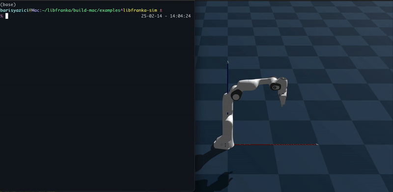
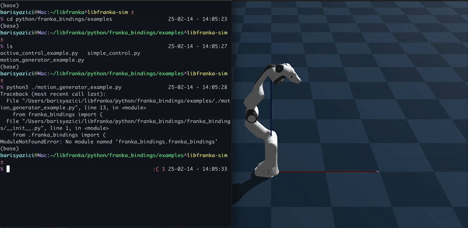

# Franka Simulation Server

A high-fidelity simulation server that communicates with the Franka robot's network protocol, enabling seamless switching between simulation and hardware. Runs on MuJoCo by default; Genesis is available as an optional backend.

## Overview

The Franka Simulation Server provides a drop-in replacement for the real Franka robot, implementing the complete libfranka network protocol. This allows developers to:

- Test and debug robot controllers in simulation before deployment
- Develop applications that work identically on both simulation and hardware
- Validate error handling and safety features
- Experiment with different control strategies risk-free

## Compatibility

`franka_sim` implements the **latest libfranka wire protocol — robot server version 10**.
In this protocol the robot model is built **client-side**: during connection the client
fetches the robot URDF via the `GetRobotModel` command and builds its own Pinocchio model.
The server therefore just serves a valid URDF (a hand-less FR3 arm by default) instead of a
precompiled model library.

You need a libfranka version that speaks **server protocol 10**:

| libfranka Version | Robot System Version | Robot/Gripper Server |
| ----------------- | -------------------- | -------------------- |
| **>= 0.18.0**     | **>= 5.9.0**         | **10 / 3** ✅ supported |
| >= 0.15.0         | >= 5.7.2             | 9 / 3 — not supported |

See the [Franka software compatibility matrix](https://frankarobotics.github.io/docs/compatibility.html)
for the full list. Older libfranka releases (server version 9 and below) use a different wire
format — double-based `RobotState` and server-side `LoadModelLibrary` instead of `GetRobotModel` —
and are **not** compatible with this server.

## Related Projects

- [libfranka-python](https://github.com/BarisYazici/libfranka-python) - Python bindings for libfranka
- [franka-gym](https://github.com/BarisYazici/franka-gym) - Franka gym implementation

## Preview Video

- Native libfranka control



- With Python




## Architecture


In this repository, we only provide the simulation server backend, with a
choice of physics engines behind it (MuJoCo by default, Genesis optionally).

The libfranka python bindings will become available in a separate repository.

The system consists of several key components:

1. **libfranka Interface Layer**
   - Implements the standard Franka robot network protocol
   - Handles TCP command interface and UDP state updates
   - Targets the latest libfranka wire protocol (robot server version 10)

2. **Physics Simulation Backend**
   - Physics-based robot simulation using MuJoCo (default) or Genesis (`--physics genesis`)
   - Real-time joint state computation and dynamics

3. **State Management**
   - Complete robot state tracking and synchronization
   - Accurate error reporting and status updates
   - Real-time state transmission (1kHz update rate)

4. **Control Modes**
   - Joint Position Control
   - Joint Velocity Control
   - Joint Torque Control
   - Supports seamless switching between modes

## Key Features

- **Protocol Compatibility**: Full implementation of the Franka robot network protocol
- **Real-time Simulation**: High-frequency state updates and control (1kHz)
- **Multiple Control Modes**: Supports position, velocity, and torque control
- **Error Handling**: Replicates real robot error states and recovery

## Getting Started

### Prerequisites
- Python 3.9+
- numpy==1.26.4
- mujoco>=3.2,<3.3 (the default physics backend, installed automatically)

Genesis is an optional backend (`--physics genesis`) — see below.

### Installation

#### Option 1: Install from PyPI (Recommended)

The package is available on PyPI and can be installed with pip. This pulls in
MuJoCo, the default physics backend:

```bash
pip install franka-sim
```

To also use the Genesis backend, install the `genesis` extra:

```bash
pip install 'franka-sim[genesis]'
```

#### Option 2: Install from Source

```bash
# Clone the repository
git clone git@github.com:BarisYazici/libfranka-sim.git

# Install the package
cd libfranka-sim/simulation
pip install -e .
```

### Basic Usage

After installation, you can run the server using the command-line executable:

```bash
# Start the server without visualization
run-franka-sim-server

# Start the server with visualization
run-franka-sim-server -v
```

Alternatively, if you installed from source, you can use:

```bash
# Start the simulation server
python -m franka_sim.run_server -v
```

In your application, use standard libfranka commands. The simulation will respond exactly like the real robot.

### Testing in CI (no robot required)

Because the sim speaks the real wire protocol, your libfranka / franka_ros2 code can be
regression-tested on every push. Three ways in — see the
[Testing in CI guide](https://barisyazici.github.io/libfranka-sim/ci/) for details:

```yaml
# GitHub Actions: start a simulated FR3, then run your tests against 127.0.0.1
- uses: BarisYazici/libfranka-sim@v1
  with:
    args: '--enforce-comm-constraints --enforce-motion-limits'
```

```bash
# Docker: self-contained image (models baked in, works offline)
docker run -d --network host ghcr.io/barisyazici/franka-sim
docker exec <container> franka-sim-check --timeout 30   # readiness gate
```

```python
# pytest: `pip install franka-sim` ships a plugin; one server per session on a free port
def test_my_controller(franka_sim_server):
    connect_my_stack(franka_sim_server.host, franka_sim_server.port)
```

With `--enforce-comm-constraints` and `--enforce-motion-limits` the sim aborts motions the way
the real FCI does (lost-cycle reflexes, discontinuity limits), so your error-recovery paths get
exercised in CI instead of on hardware.

### Gripper (Franka Hand)

The gripper server (libfranka gripper protocol, **TCP port 1338**) runs **by default** alongside
the arm. Drive it with the standard `franka::Gripper` client (`homing` / `move` / `grasp` / `stop`).

```bash
# Arm + gripper, kinematic hand (no mesh; width tracked analytically, CI-friendly)
python -m franka_sim.run_server -v

# Arm + gripper, physics-backed Franka Hand: the hand mesh is loaded and the
# finger DOFs are simulated, so homing/move/grasp visibly move the fingers in
# the viewer (grasp succeeds on a finger-position stall against an object)
python -m franka_sim.run_server -v --gripper-physics

# Disable the gripper server entirely
python -m franka_sim.run_server -v --no-gripper
```

| Flag | Gripper backend | Hand in viewer |
| ---- | --------------- | -------------- |
| *(default)* | `FrankaHandSim` (kinematic) | no |
| `--gripper-physics` | `FrankaHandPhysics` (physics) | yes, fingers move |
| `--no-gripper` | none (arm only) | no |

### Mobile duo (two arms + TMR base on one scene)

`--mobile-duo` serves the mobile FR3 duo: one physics scene (both arms and the
TMR mobile base, physically rigid to each other) driven by **three** FCI
bridges, one per role. libfranka clients cannot be told to use a port other
than 1337, so the bridges are separated by **host IP** instead — each is
bound to its own loopback alias with `--bind ROLE=HOST`, repeated once per
role (`left`, `right`, `base`):

```bash
# Bring up the loopback aliases once per boot (Linux; 127.0.0.0/8 is all loopback)
sudo ip addr add 127.0.0.11/8 dev lo 2>/dev/null
sudo ip addr add 127.0.0.12/8 dev lo 2>/dev/null
sudo ip addr add 127.0.0.13/8 dev lo 2>/dev/null  # only needed with --spine

python -m franka_sim.run_server --mobile-duo \
  --scene-urdf /path/to/mobile_fr3_duo.urdf \
  --mesh-root  /path/to/franka_description \
  --bind left=127.0.0.11 \
  --bind right=127.0.0.12 \
  --bind base=127.0.0.10
```

| Flag | Meaning |
| ---- | ------- |
| `--mobile-duo` | Serve the mobile duo instead of the classic single-arm server |
| `--scene-urdf PATH` | The combined `mobile_fr3_duo` URDF loaded into the one physics scene (required with `--mobile-duo`; see below for generating it) |
| `--mesh-root PATH` | Package root used to resolve `package://` mesh URIs in the URDF — a `franka_description` checkout; defaults to the URDF's own directory |
| `--bind ROLE=HOST` | Bind one bridge to a host address; repeat for `left`, `right` and `base` (all three are required) |
| `--physics {genesis,mujoco}` | Physics backend for the scene (default `mujoco`) |

By convention this repo uses three loopback aliases on `127.0.0.0/8`, one per
role, plus a fourth for the spine device:

| Role | Address |
| ---- | ------- |
| base | `127.0.0.10` |
| left arm | `127.0.0.11` |
| right arm | `127.0.0.12` |
| spine | `127.0.0.13` |

Every bridge still listens on the standard libfranka command port (1337);
override it for all three at once with `--port`.

**Physics backend.** MuJoCo is the default (`--physics mujoco`, or just omit
the flag) and is installed as a core dependency. `--physics genesis` runs the
same scene on Genesis instead, and needs the `genesis` extra:
`pip install 'franka-sim[genesis]'`. Genesis' per-call kernel-launch overhead
caps the scene at ~0.4x real time at its 2.5 ms step; MuJoCo holds **1.00x
real time at a 1 ms step** — the rate the FCI bridges actually serve — using
about a third of one core. The protocol surface, the joint and link names,
the initial pose and the reported state are identical between the two, so a
client cannot tell them apart. Contacts are disabled on the MuJoCo path (the
chassis' URDF collision meshes interpenetrate as authored, and nothing in
this scene depends on contact: the base pose is integrated kinematically and
both arms are servo-driven).

**Generating `--scene-urdf`.** `scripts/generate_mobile_duo_urdf.sh
<franka_description_dir> <output.urdf>` runs the upstream xacro with the
options this server expects (`hand:=false`, explicit `robot_types`, no
ROS 2 control/Gazebo) from a sourced ROS 2 Jazzy environment. It asserts the
`franka_description` checkout is pinned to the exact sha the mesh paths and
joint names were generated against, and refuses to run otherwise — a
different checkout can silently rename meshes or joints out from under the
sim.

**The fake spine device.** The duo's prismatic lift
(`franka_spine_vertical_joint`) is driven by a separate REST device on real
hardware, not by libfranka. `--spine` runs a fake version of that device
in-process (`franka_sim.mobile.spine_stub`) and shares its motion model with the
scene, so a REST move visibly raises the lift (and everything mounted on
it — the head and both arms) in the viewer:

```bash
python -m franka_sim.run_server --mobile-duo \
  --scene-urdf /path/to/mobile_fr3_duo.urdf --mesh-root /path/to/franka_description \
  --bind left=127.0.0.11 --bind right=127.0.0.12 --bind base=127.0.0.10 \
  --spine
```

| Flag | Meaning |
| ---- | ------- |
| `--spine` | Also run the spine stub in-process (requires `--mobile-duo`) |
| `--spine-host` | Address the spine stub binds (default: `127.0.0.13`) |
| `--spine-port` | Port the spine stub binds; `SpineApiClient` hardcodes 443 with no port, so leave this at the default unless you know why you're changing it (default: `443`) |
| `--spine-cert` / `--spine-key` | TLS certificate/key for the stub; a throwaway self-signed pair is generated automatically when omitted |

The spine stub also runs standalone via the `run-franka-spine-stub` console
script (installed with the package), useful for exercising just the REST
device without a physics scene:

```bash
run-franka-spine-stub --host 127.0.0.13 --port 443
```

**Cartesian-velocity protocol mode.** The TMR base has no joint interface, so
it is driven by libfranka's `kCartesianVelocity` motion generator: the
client's commanded body-frame twist (`O_dP_EE_c`) is routed straight to the
base's swerve inverse kinematics instead of to a joint position/velocity/
torque path.

**Environment variables.**

| Variable | Meaning |
| -------- | ------- |
| `FRANKA_SIM_SPINE_PORT` | Test-suite only. `SpineApiClient` hardcodes port 443, which needs root to bind; set this to point the mobile-duo end-to-end tests at an unprivileged port instead (e.g. via an `iptables` `REDIRECT 443 -> 8443`) |

### Troubleshooting

If you're running the Genesis backend (`--physics genesis`) and encounter
issues related to missing asset files, make sure you have the `genesis`
extra installed with the correct version of `genesis-world`:

```bash
pip install 'franka-sim[genesis]'
```

The simulator automatically uses the assets provided by the Genesis package,
so no additional asset files are needed. Note that `genesis-world==0.2.1`
also needs `libigl<2.6` (newer libigl changes `igl.signed_distance`'s return
arity); install that pin alongside the extra if Genesis import fails with an
unpacking error.

## Configuration

## Switching Between Simulation and Hardware

To switch between simulation and hardware:

1. Update the robot IP address in your application:
   - Use `localhost` or `127.0.0.1` for simulation
   - Use the real robot's IP for hardware

2. No other changes needed - your application code remains identical

## Development Status

The simulation server currently implements all major features of the Franka robot:

- [x] Complete network protocol implementation
- [x] All joint interfaces
- [x] Real-time state updates
- [x] Visualization support
- [x] Genesis connection
- [x] libfranka python bindings
- [x] v10 wire protocol (Connect, float-based RobotState, GetRobotModel/URDF)
- [x] Robot model via URDF (client-side Pinocchio through GetRobotModel)
- [x] Gripper simulation / Franka Hand (kinematic + Genesis physics, `--gripper-physics`)
- [x] Automatic error recovery (so `franka_hardware` / franka_ros2 can activate)
- [ ] Advanced collision detection (in progress)
- [ ] Cartesian interfaces (planned)


## Contributing

Contributions are welcome! Please read our contributing guidelines and submit pull requests to our repository.

## License

This project is licensed under the Apache License Version 2.0 - see the LICENSE file for details.

## Acknowledgments

- Franka Robotics GmbH for the original libfranka implementation
- The Genesis Simulator team for the physics engine
