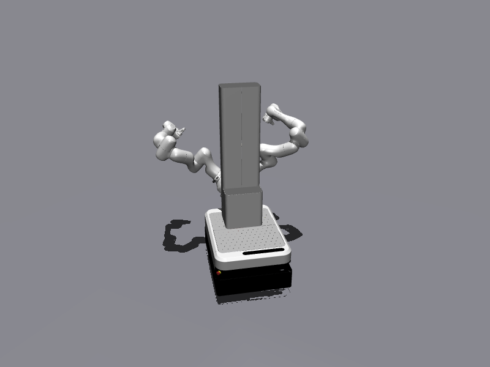
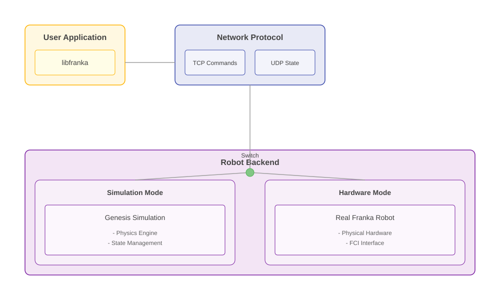

# franka-sim

**franka-sim is a simulator for the Franka Control Interface that speaks the real
wire protocol.** It listens on TCP port 1337 for libfranka's v10 command protocol
and streams `RobotState` over UDP at 1 kHz, byte-for-byte in the layout libfranka
expects. Unmodified client code — the official C++ examples, `franka_ros2`, your own
controller — connects to it exactly the way it connects to an FR3, by pointing at a
different IP address.

{ loading=lazy }

/// caption
The `--mobile-duo` scene: two FR3 arms plus a prismatic lift on a TMR swerve base,
one physics scene served by three FCI bridges.
[Watch it move &rarr;](mobile-duo.md)
///

---

## Why it exists

The usual robot simulator gives you a Python API and asks you to write a second
version of your controller against it. franka-sim gives you a socket. Everything
above the socket — libfranka, `franka_hardware`, `ros2_control`, your motion
generator, your 1 kHz torque loop — runs the code that will run on hardware, with
its real timing, its real handshakes and its real state struct.

That makes the sim useful for the things a Python-API simulator cannot check:
protocol handshakes, controller activation, timing behaviour under a 1 ms budget,
and the sim2real gap in the layer you actually deploy.

## What you get

<div class="grid cards" markdown>

-   __The real protocol, not an approximation__

    libfranka wire protocol v10 (robot server 10 / gripper server 3). `Connect`,
    `Move`, `StopMove`, `GetRobotModel`, `AutomaticErrorRecovery` and the setter
    commands; the 1377-byte packed `RobotState` struct; the `startMotion()` mode
    handshake. Verified against a real libfranka v10 client binary in CI-capable
    tests.

-   __MuJoCo at true 1 kHz__

    The default backend steps at 1 ms — one physics step per FCI control cycle —
    and holds 1.00x real time on about a third of one core. No sub-sampling, no
    "close enough" 500 Hz. [Genesis](backends.md) is available as an extra for
    GPU-parallel RL scenes.

-   __Single FR3, with or without a hand__

    A hand-less FR3 arm by default, plus a Franka Hand gripper server on port 1338.
    `--gripper-physics` loads the hand mesh and simulates the finger DOFs, so
    `homing`/`move`/`grasp` visibly move the fingers.

-   __The mobile FR3 duo__

    Two arms, a TMR swerve base and a vertical lift in one scene, served by three
    FCI bridges plus a fake spine REST device. Drop-in for the real mobile rig —
    same client configs, sim IPs swapped in. [See the showcase](mobile-duo.md).

-   __Headless-first__

    The viewer is an opt-in flag (`-v`), not the main loop. Everything runs on a
    server without a display: CI, batch rollouts, remote GPU boxes.

-   __Honest about its gaps__

    Some `RobotState` fields are physics-measured, some echo your command, some are
    constants. [The fidelity reference](robot-state.md) tells you which is which,
    field by field, with code references — before it bites you.

</div>

## Quickstart

```bash
pip install franka-sim      # (1)!
run-franka-sim-server -v    # (2)!
```

1. Pulls MuJoCo, the default physics backend. The FR3 model itself is fetched from
   MuJoCo Menagerie on first run via `robot_descriptions`.
2. Drop `-v` to run headless. The FCI listens on `127.0.0.1:1337`, the gripper on
   `127.0.0.1:1338`.

Then point any libfranka client at `127.0.0.1` — no recompile, no shim:

```cpp
franka::Robot robot("127.0.0.1");
robot.setCollisionBehavior(/* ... */);
robot.control([](const franka::RobotState& state, franka::Duration) {
  // your 1 kHz callback, unchanged
});
```

Or with the official examples, straight from a libfranka build tree:

```bash
./examples/communication_test 127.0.0.1
./examples/generate_joint_velocity_motion 127.0.0.1
```

!!! warning "libfranka >= 0.18.0 required"

    franka-sim implements **server protocol version 10** only. libfranka 0.15–0.17
    speak protocol 9 — a different `RobotState` layout (double-based) and
    server-side `LoadModelLibrary` instead of `GetRobotModel` — and will not
    connect. See [the compatibility matrix](compatibility.md).

## Where to go next

| If you want to… | Read |
| --- | --- |
| Install it, and know every CLI flag | [Installation](install.md) |
| Know whether *your* client will work | [Client compatibility](compatibility.md) |
| Know which state fields are real physics | [State & command fidelity](robot-state.md) |
| Run the two-arm mobile rig, or VR teleop | [Mobile FR3 duo](mobile-duo.md) |
| Choose between MuJoCo and Genesis | [Physics backends](backends.md) |

## Architecture

{ loading=lazy }

The server is three layers:

1. **Protocol layer** — the TCP command socket (1337) and the UDP state/command
   pair. Owns the `RobotState` struct, the `Move` handshake and the control-mode
   state machine.
2. **Physics layer** — MuJoCo (default) or Genesis, behind one interface. The
   protocol layer calls identical methods on either, so a client cannot tell them
   apart from the wire.
3. **Device stubs** — the gripper server (port 1338, gripper protocol 3) and, for
   the mobile duo, the spine REST device.

The robot model is built *client-side* in protocol v10: during connection the client
fetches a URDF through `GetRobotModel` and builds its own Pinocchio model, so the
server ships a URDF rather than a compiled model library.
