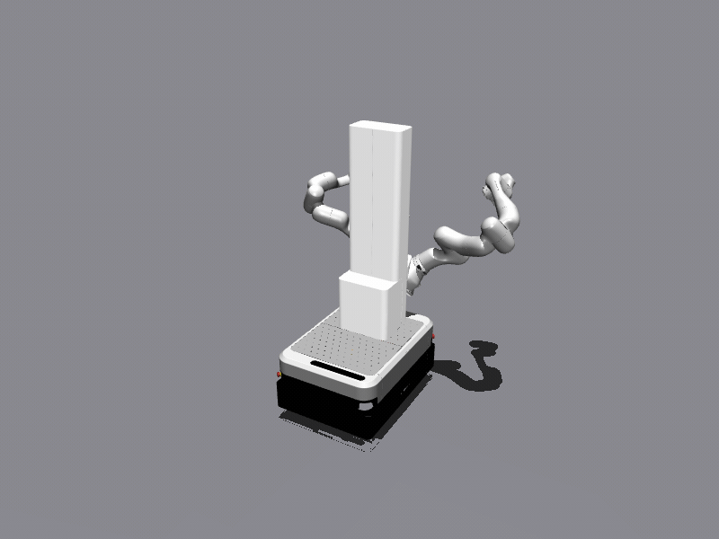
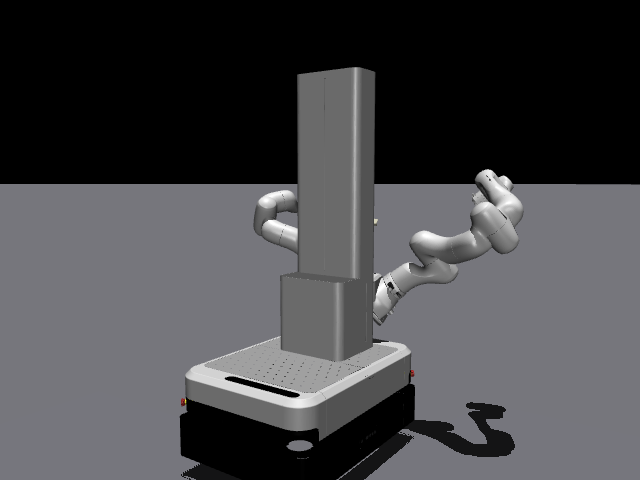

# Mobile FR3 duo

Two FR3 arms and a vertical lift on a TMR swerve base, in one physics scene, served
by three independent FCI bridges plus a REST spine device. To a client stack it is
three robots and a lift controller — the same three robots and lift controller it
talks to on the real rig.

{ loading=lazy }

/// caption
`--mobile-duo --spine`: the swerve base drives, the spine lift raises everything
mounted on it, and both arms move under torque control — one scene, three FCI
bridges.
///

## Architecture

The whole rig is **one physics scene**. The arms are rigidly mounted to the lift
and the lift to the chassis, so base motion carries both arms — exactly as on
hardware. What is split is the *protocol* surface:

```text
                    ┌──────────────────────────────────────────┐
                    │        one MuJoCo physics scene          │
                    │   TMR base + lift + left FR3 + right FR3 │
                    └───┬──────────┬──────────┬────────────┬────┘
                        │          │          │            │
              ┌─────────┴──┐  ┌────┴─────┐  ┌─┴────────┐  ┌┴──────────┐
              │ FCI bridge │  │ FCI      │  │ FCI      │  │ spine     │
              │ base       │  │ bridge   │  │ bridge   │  │ REST stub │
              │            │  │ left     │  │ right    │  │           │
              │ 127.0.0.10 │  │127.0.0.11│  │127.0.0.12│  │127.0.0.13 │
              │ TCP 1337   │  │ TCP 1337 │  │ TCP 1337 │  │ HTTPS 443 │
              │ Cartesian  │  │ joint    │  │ joint    │  │ prismatic │
              │ velocity   │  │ pos/vel/ │  │ pos/vel/ │  │ lift      │
              │ (twist)    │  │ torque   │  │ torque   │  │ move      │
              └────────────┘  └──────────┘  └──────────┘  └───────────┘
```

**Why three IPs and not three ports.** libfranka hard-codes the command port to
1337 and offers no override, so three robots cannot share an address. On Linux all
of `127.0.0.0/8` is loopback, so each bridge gets its own `127.0.0.x` — no
interface aliasing tricks, just `ip addr add`.

**Why the base speaks Cartesian velocity.** The TMR base has no joint interface. It
is driven through libfranka's `kCartesianVelocity` motion generator: the client's
commanded body-frame twist (`O_dP_EE_c`) is routed straight into the base's swerve
inverse kinematics — per-module steering angle and wheel speed, with the
π-ambiguity resolved to minimise steering travel from the previous command. This
mirrors the real TMR master, which does swerve IK onboard and treats the wheel
joints as state-report-only.

**Why the spine is REST, not FCI.** On hardware the prismatic lift
(`franka_spine_vertical_joint`) is driven by a separate REST device, not by
libfranka. `--spine` runs a fake version of that device in-process, serving the same
HTTPS routes from a constant-velocity motion model and sharing its motion state with
the scene — so an unmodified `franka_spine_server` can drive it and the lift visibly
rises in the viewer, carrying the head and both arms with it.

{ loading=lazy width="480" }

/// caption
The TMR chassis and the prismatic spine lift, rendered from the duo scene.
///

## The address contract

Client stacks configure the rig from a `.env` file. The sim adopts the same
convention, so switching between sim and hardware is an IP swap and nothing else:

| Role | Address | Interface |
| --- | --- | --- |
| base | `127.0.0.10` | FCI, TCP 1337, Cartesian velocity |
| left arm | `127.0.0.11` | FCI, TCP 1337, joint position / velocity / torque |
| right arm | `127.0.0.12` | FCI, TCP 1337, joint position / velocity / torque |
| spine | `127.0.0.13` | REST over HTTPS, port 443 |

Plus one flag on the client side: **`FAKE_GRIPPERS=true`**. The duo scene serves
hand-less arms — no gripper server is bound for the duo roles — so the client stack
must be told to stub its gripper interfaces out rather than wait for a connection
on port 1338.

## Launching it

Bring the loopback aliases up once per boot:

```bash
sudo ip addr add 127.0.0.10/8 dev lo   # base
sudo ip addr add 127.0.0.11/8 dev lo   # left arm
sudo ip addr add 127.0.0.12/8 dev lo   # right arm
sudo ip addr add 127.0.0.13/8 dev lo   # spine (only needed with --spine)
```

Then start the server:

=== "Full rig (arms + base + spine, viewer)"

    ```bash
    run-franka-sim-server --mobile-duo -v \
      --scene-urdf /path/to/mobile_fr3_duo.urdf \
      --mesh-root  /path/to/franka_description \
      --bind base=127.0.0.10 \
      --bind left=127.0.0.11 \
      --bind right=127.0.0.12 \
      --spine
    ```

=== "Headless, no spine"

    ```bash
    run-franka-sim-server --mobile-duo \
      --scene-urdf /path/to/mobile_fr3_duo.urdf \
      --mesh-root  /path/to/franka_description \
      --bind base=127.0.0.10 \
      --bind left=127.0.0.11 \
      --bind right=127.0.0.12
    ```

=== "On the Genesis backend"

    ```bash
    run-franka-sim-server --mobile-duo --physics genesis \
      --scene-urdf /path/to/mobile_fr3_duo.urdf \
      --mesh-root  /path/to/franka_description \
      --bind base=127.0.0.10 \
      --bind left=127.0.0.11 \
      --bind right=127.0.0.12
    ```

    Needs the `[genesis]` extra, and caps out around 0.4x real time on this scene.
    See [backends](backends.md).

### Generating the scene URDF

`--scene-urdf` wants the combined `mobile_fr3_duo` URDF. Build it with the bundled
script:

```bash
scripts/generate_mobile_duo_urdf.sh <franka_description_dir> <output.urdf>
```

It runs the upstream xacro from a sourced ROS 2 Jazzy environment with the options
this server expects (`hand:=false`, explicit `robot_types`, no ROS 2 control or
Gazebo tags).

!!! warning "The script pins the `franka_description` sha on purpose"

    It asserts the checkout is at the exact commit the mesh paths and joint names
    were generated against, and refuses to run otherwise. A different checkout can
    silently rename meshes or joints out from under the sim — the failure mode is a
    scene that loads and then behaves subtly wrong, which is far worse than a
    refusal.

## VR teleoperation

The duo scene exists because there is a real rig it stands in for. The lab stack at
[`BarisYazici/fr3-droid`](https://github.com/BarisYazici/fr3-droid), branch
`feat/fr3-mobile-duo`, drives that rig with a **Meta Quest 2/3** doing DROID-style
teleoperation: the headset's controller poses become end-effector targets, and the
targets go through `ros2_control` and `franka_ros2` down to **1 kHz torque control**
on both arms, while the operator drives the base and lift.

Against franka-sim, that entire stack runs unchanged. The same config file, the same
controllers, the same 1 kHz loop — only the IPs in `.env` point at
`127.0.0.10`–`.13` instead of the rig. That is the whole point of the
protocol-level approach: the teleop stack cannot tell it is not talking to the
robot, so what you debug in sim is the code that ships.

Practically this means you can develop and tune the teleop mapping, the controller
switching and the base/arm coordination without booking the rig — and, since the
sim is headless-capable, run it on a server with the Quest driving it over the
network.

## Limitations

The duo scene is a protocol- and kinematics-faithful stand-in, not a
dynamics-calibrated digital twin. Be precise about what it does not give you:

!!! danger "Contacts are disabled in the duo scene"

    Unlike the single-arm scene, contacts are switched off entirely here. The
    chassis' URDF collision meshes interpenetrate as authored, and nothing in the
    scene currently depends on contact — the base pose is integrated kinematically
    and both arms are servo-driven. **The arms will pass through the chassis, the
    lift and each other.** Do not use this scene to validate collision avoidance or
    self-collision limits.

!!! warning "Arm gains are not calibrated against real-FR3 logs"

    The position-mode PD gains are fixed constants, and `SetJointImpedance` is
    [acknowledged but not enforced](robot-state.md#tcp-commands). Independent
    measurements against a real FR3 show the sim over-travelling by roughly
    1.15–1.28× and ringing where the real arm settles, because joint friction is not
    modelled. Trajectories will look right in shape and wrong in damping.

!!! warning "Base odometry is open-loop dead reckoning"

    The base's `O_T_EE` is the commanded twist, Euler-integrated — no wheel contact
    or slip feeds back into it. It cannot drift the way real odometry drifts, and it
    cannot be wrong the way real odometry is wrong. A known diagnostic artefact:
    the reported odometry shows a small wobble during steering transitions.

Broader per-field detail is in [State & command fidelity](robot-state.md).
